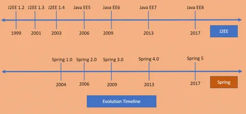
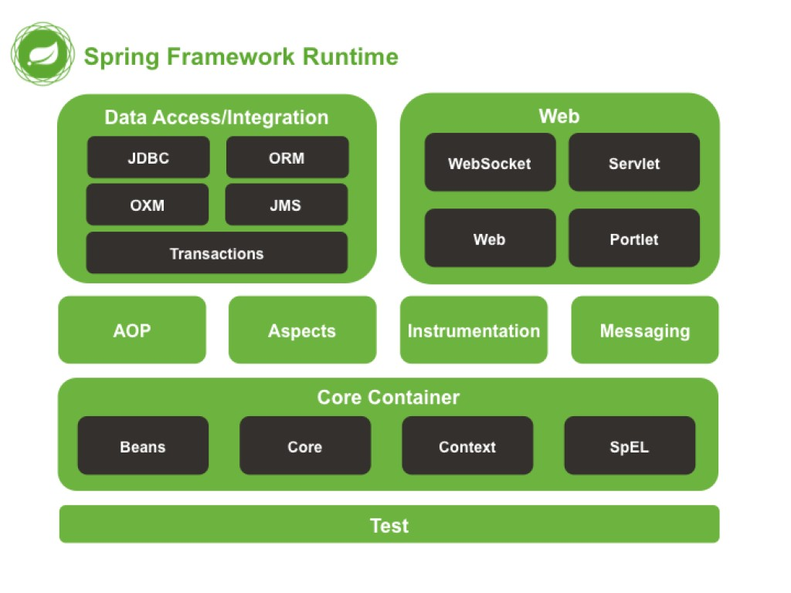
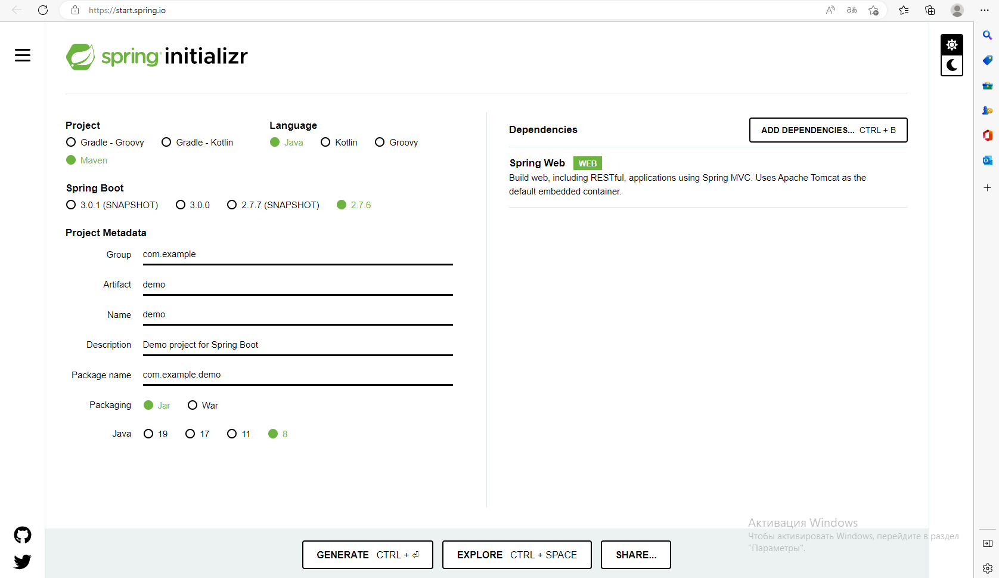
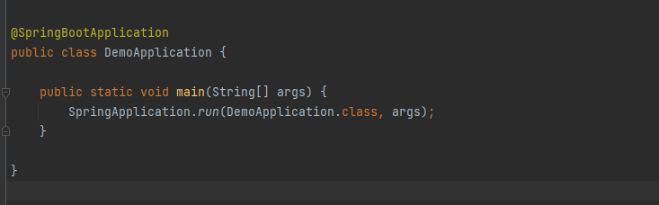
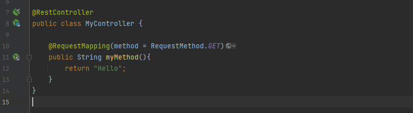
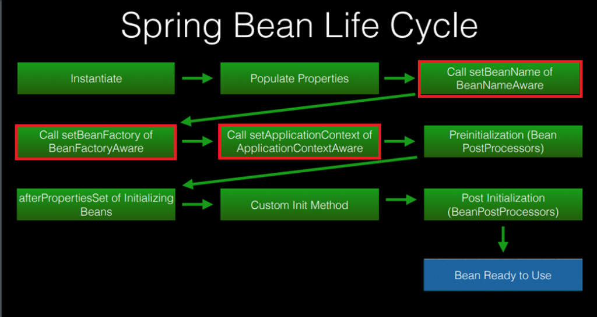
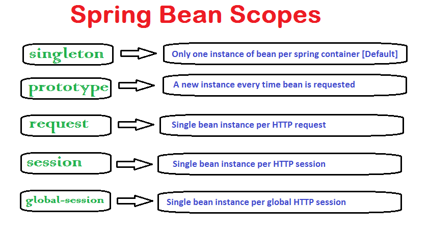
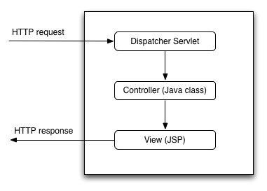
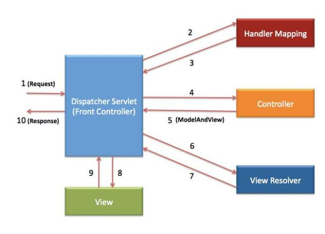
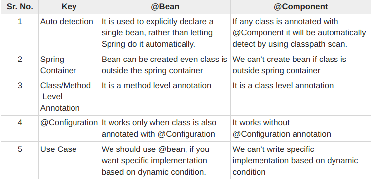

# Spring

Spring, или Spring Framework — фреймворк для языка программирования Java. Он нужен, чтобы разработчикам было легче проектировать и создавать приложения. Spring не связан с конкретной парадигмой или моделью программирования, поэтому его могут использовать как каркас для разных видов приложений.

В июне 2003 года Spring 0.9 выпустили под лицензией Apache 2.0.

В марте 2004 года выходит Spring 1.0. Интересно, что даже до выпуска Spring 1.0, предыдущую версию 0.9 очень тепло восприняли, и она получила широкое распространение.

В августе 2004 года Род Джонсон, Юрген Хеллер, Кейт Дональд и Колин Сампалеану стали соучредителями interface21 — компании, которая занимается консультированием, обучением и поддержкой по Spring.

Октябрь 2006 года: выходит версия Spring 2.0, которая упростила файлы конфигурации XML.

В Spring 2.5, появившейся в ноябре 2007 года, были представлены конфигурации аннотаций.

Spring 3.2, вышедшая в декабре 2012 года, представила конфигурацию Java, поддерживала Java 7, Hibernate 4, Servlet 3.0, а также требовала как минимум Java 1.5.

Янн Карофф покинул команду в самом начале. Род Джонсон покинул “весеннюю” команду в 2012 году. Юрген Хеллер по-прежнему является активным членом команды разработчиков Spring.

В Spring 4.0, вышедшая в 2014 году, добавили поддержку Java 8.

Также в 2014 году миру представили Spring Boot.

Spring 5.0 вышла в 2017 году. Как и Spring Boot 2.x, который поддерживает Spring 5.

# Кто пользуется Spring

Java-разработчики, которые занимаются созданием десктопных, мобильных или веб-приложений, — Spring можно использовать в любом из направлений. Чаще всего речь идет о проектах enterprise-масштаба.

Kotlin-разработчики, так как этот язык написан на основе Java и использовался для создания Spring.

Системные архитекторы и инженеры, основная задача которых — проектировать будущие проекты. Spring можно использовать как каркас, шаблон для приложения, поэтому он важен в проектировании и анализе.

Иногда — бэкенд-разработчики, так как в некоторых случаях серверная часть сайта может быть написана на Java.

# В чем разница между Spring и Spring Boot

В начале работы с фреймворком можно перепутать Spring и Spring Boot. Это не отдельный фреймворк, а дополнение к Spring, которое облегчает работу с ним. Spring нужно конфигурировать для каждого нового проекта. Конфигурация может занять много времени и не дать ощутимые преимущества в дальнейшей работе. Чтобы исправить проблему, был создан Spring Boot. Он включает комплекс утилит для автоматизации настройки.

Spring Boot:

автоматически конфигурирует проекты на основе одного из стартовых пакетов для них;

облегчает создание и развертывание приложений на Spring;

быстро и легко управляет зависимостями и подгружает необходимые модули;

поддерживает встроенный сервер для запуска приложений;

может автоматически создать и настроить базу данных для приложения.

При необходимости настройки Spring Boot можно изменить, чтобы он конфигурировал и настраивал компоненты иначе. Набор утилит облегчает работу со Spring, поэтому некоторые туториалы по умолчанию написаны с учетом использования Spring Boot.

Инверсия управления (Inversion of Control, IoC) это определенный набор рекомендаций, позволяющих проектировать и реализовывать приложения используя слабое связывание отдельных компонентов. То есть, для того чтобы следовать принципам Инверсии управления нам необходимо:

Реализовывать компоненты, отвечающие за одну конкретную задачу;

Компоненты должны быть максимально независимыми друг от друга;

Компоненты не должны зависеть от конкретной реализации друг друга.

Одним из видов конкретной реализации данных рекомендаций является механизм Внедрения зависимостей (Dependency Injection, DI). Он определяет две основные рекомендации:

модули верхних уровней не должны зависеть от модулей нижних уровней. Оба типа модулей должны зависеть от абстракций;

абстракции не должны зависеть от деталей. Детали должны зависеть от абстракций.

Простое объяснение

IOC - принцип проектирования. Когда один компонент может зависеть от интерфейса какого-то другого компонента, но не от его реализации. У этого принципа есть 2 вида шаблонов:

DI - шаблон, когда мы указываем в интерфейсе нашего компонента (через конструктор или сеттер), от чего тот зависит.

# Первый проект

# Бины в SPRING

Начнем срывать покровы с самых базовых понятий Spring. Бин (bean) — это не что иное, как самый обычный объект. Разница лишь в том, что бинами принято называть те объекты, которые управляются Spring-ом и живут внутри его DI-контейнера. Бином является почти все в Spring — сервисы, контроллеры, репозитории, по сути все приложение состоит из набора бинов. Их можно регистрировать, получать в качестве зависимостей, проксировать, мокать и т.п.

# Контекст

Представлен интерфейсом ApplicationContext. По сути, представляет собой само приложение Spring. Так же контекст предоставляет возможности реагировать на различные события, которые происходят внутри приложения, управлять жизненным циклом бинов (создавать как синглтон или на каждый запрос, например).

В основе "магии" Spring Boot нет ничего магического, он использует совершенно базовые понятия из Spring Framework. В кратком виде процесс можно описать так:

Аннотация @SpringBootApplication включает сканирование компонентов и авто-конфигурацию через аннотацию @EnableAutoConfiguration

@EnableAutoConfiguration импортирует класс EnableAutoConfigurationImportSelector

EnableAutoConfigurationImportSelector загружает список конфигураций из файла META-INF/spring.factories

Каждая конфигурация пытается сконфигурить различные аспекты приложения (web, JPA, AMQP etc), регистрируя нужные бины и используя различные условия (наличие / отсутствие бина, настройки, класса и т.п.)

Созданный в итоге AnnotationConfigEmbeddedWebApplicationContext ищет в том же DI контейнере фабрику для запуска embedded servlet container

Servlet container запускается, приложение готово к работе!

# @Autowired

Аннотация позволяет вам пропустить настройки в другом месте того, что нужно вводить, и просто делает это за вас. 

Способы внедрения зависимостей:
Сеттеры

    @Autowired
    public void setName(MyTime myTime) {
        this.name = myTime.getTime();
    }

Конструктор

    @Autowired
    public MyController(MyTime myTime) {
        this.myTime = myTime;
    }

Поле

    @Autowired
    private MyTime myTime;

# DispatcherServlet

Dispatcher Servlet — сердце Spring Web MVC, полностью настраиваемый фронт-контроллер, координирующий все действия по обработке запросов

Это типичный шаблон дизайна при разработке веб-приложений, распределяющий запросы пользователя и управляющий работой других компонентов приложения, отсылая команды каждому конкретному контроллеру Spring MVC. Он отвечает за инициализацию интерфейса WebApplicationContext, загружая конфигурацию относящуюся к веб-компонентам

Жизненный цикл запроса

Принцип его работы показан на изображении выше, каждый шаг промаркирован, давайте разберем все поэтапно:

- Фронт-контроллер DispatcherServlet получает запрос. 
- DispatcherServlet передает этот запрос HandlerMapping — интерфейсу, реализуемому объектами, определяющими отображение (маппинг) между запросами для поиска подходящего контроллера. 
- HandlerMapping отправляет сведения о контроллере назад в DispatcherServlet. 
- DispatcherServlet вызывает контроллер, ранее идентифицированный через HandlerMapping. Выбранный контроллер обрабатывает запрос, вызвав соответствующий метод для подготовки данных и создав некую бизнес-логику (или напрямую извлекает информацию из базы данных). 
- Контроллер возвращает DispatcherServlet необходимые данные модели и информацию по UI для подбора внешнего вида их отображения. 
- Как только DispatcherServlet получает объект ModelAndView, он передает его ViewResolver — интерфейсу, способному находить (резолвить) вид по его имени (View Name), чтобы затем найти соответствующий вариант отображения View. 
- Определившись с выбором, ViewResolver отправляет нужные сведения обратно фронт-контроллеру. 
- DispatcherServlet вызывает соответствующий View (определенный ViewResolver). 
- View создает отклик в виде HTML-кода и отправляет его назад. 
- В конце главный контроллер предоставляет инструкции браузеру для настройки данного HTML и последующего отображения результата конечному пользователю

SpringApplicationContext— это место, где Spring хранит экземпляры объектов, которые она определила для автоматического управления и распространения.
@Component— это аннотация, которая позволяет Spring автоматически обнаруживать наши пользовательские компоненты.

Другими словами, без необходимости писать какой-либо явный код, Spring будет:

- Отсканируйте наше приложение на наличие классов с комментариями@Component

- Создайте их экземпляры и вставляйте в них любые заданные зависимости

- Вводите их туда, где это необходимо

@Component - создает бины классов
@Bean - можно применять только к методам, которые находятся в классе, который помечен аннотацией @Configuration.

